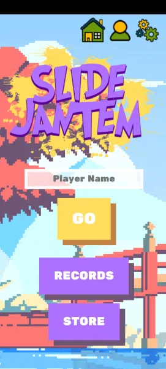
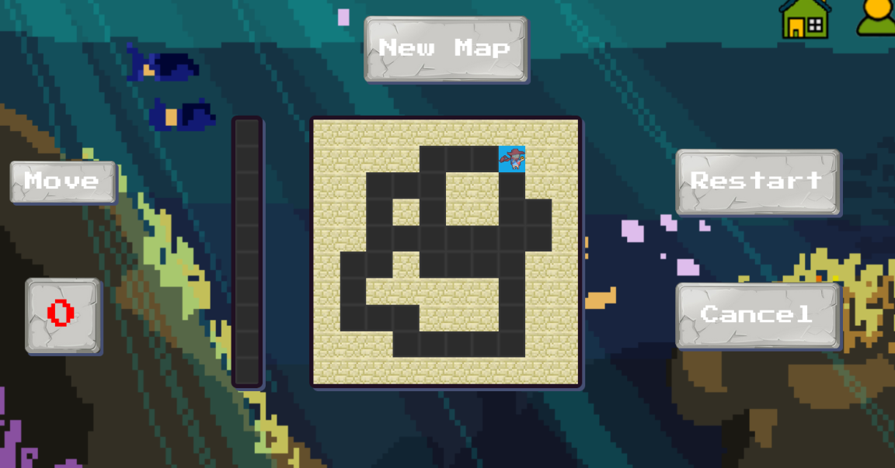
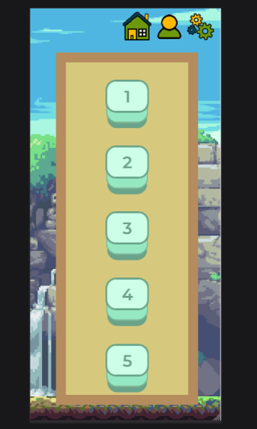
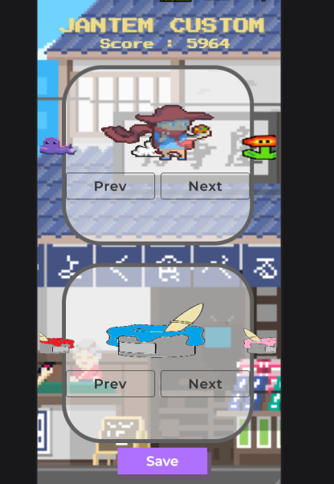
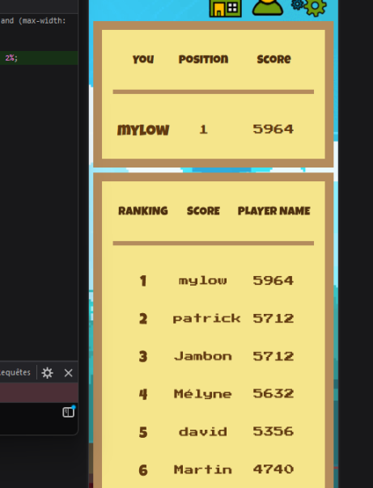
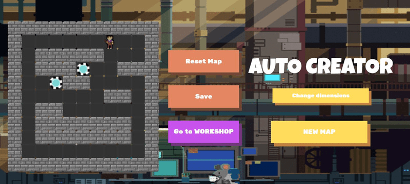
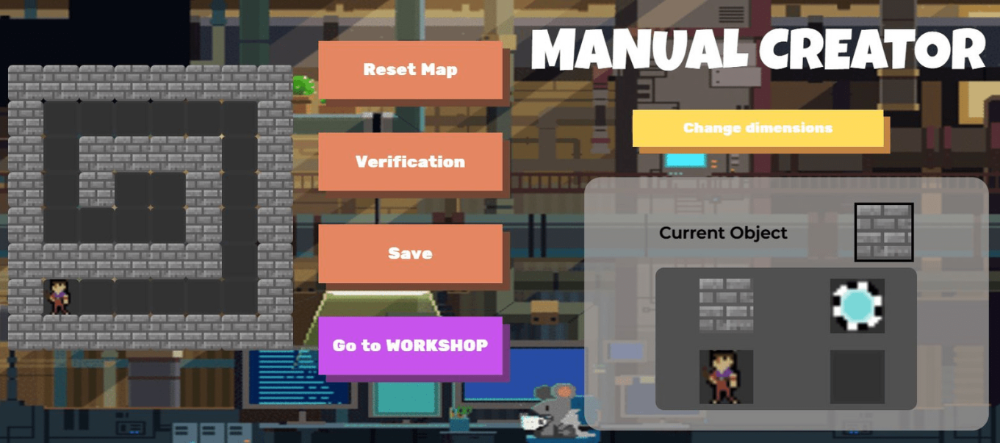

# SlideJantem

## Introduction

SlideJantem is a captivating puzzle game with a pixel-art aesthetic, designed as a year-end project. It invites players to solve puzzles in a maze format, offering a mix of strategy and creativity.










## Installation

Clone the repository to get started:
```bash
git clone https://github.com/nolancacheux/SlideJantemGame.git
```

## Features
- Dynamic puzzle-solving gameplay
- Pixel-art design for a retro aesthetic
- Leaderboards to track high scores
- Avatar customization options
- Level editor to create and share custom maps

## Dependencies
- PHP server environment
- Modern web browser with JavaScript enabled


# Nolan CACHEUX